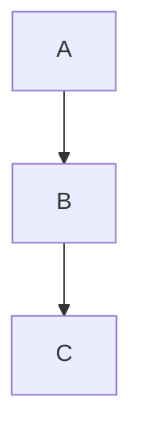

# NexAI

OpenAI-compatible AI chat client built with Flutter. Material Design 3 across Windows, Android, and Web, with notes, tools, encrypted cloud sync, and Android-oriented security hardening.


**Repository:** [github.com/Chloemlla/NexAI](https://github.com/Chloemlla/NexAI)

## Highlights

| Area | What you get |
| --- | --- |
| Chat | OpenAI-compatible + Google Vertex AI, streaming, multi-session, search, edit & resend |
| Rendering | GFM Markdown, syntax highlighting, LaTeX, chemistry (`\ce{...}`), Mermaid flowcharts |
| Notes | Markdown notes, tags, wiki-links, knowledge graph, save from chat |
| Tools | Media, converters, password generator, short URL, artifacts share, AI translate & image gen |
| Account | Login/register, Google Sign-In (Android/Web), Passkeys (Android) |
| Sync | NexAI `/sync/v2` end-to-end encrypted sync (+ WebDAV / Upstash options in settings) |
| Security | Secure storage, request signing, certificate pinning (TOFU), device checks (Android) |

## Features

### Chat

- **OpenAI-compatible API** — OpenAI, Claude proxies, DeepSeek, local models, and other `/v1` endpoints
- **Google Vertex AI** — Project / location / API key configuration in Settings
- **Streaming responses** — Token-by-token output with smart auto-scroll
- **Multiple conversations** — Unlimited sessions with per-session history
- **Message search** — Full-text search across conversations with highlighted hits
- **Edit & resend** — Edit a user message and regenerate from that point
- **Image generation** — Text-to-image / image-to-image via compatible APIs
- **Export bubble to PNG** — Capture any message bubble as an image

### Rendering

- **GitHub-flavored Markdown** with syntax-highlighted code blocks
- **LaTeX** — Inline `$...$` and display `$$...$$`
- **Chemistry** — `\ce{...}` notation
- **Mermaid flowcharts** — Parsed and painted from model output

### Notes

- **Markdown editor** with live preview
- **Tags** — `#tag` in body and YAML frontmatter
- **Wiki-links** — `[[note]]`, `[[note|alias]]`, `[[note#heading]]`
- **Knowledge graph** — Visual map of note connections
- **Star & organize** — Starred, recent, and tag-filtered views
- **Save from chat** — Persist an AI reply into a new or existing note

### Tools

| Category | Tools |
| --- | --- |
| Media | Video compressor, video → audio (MP3/AAC) |
| Convert | Date/time converter, Base64 encode/decode |
| Security | Configurable password generator with history |
| Network | Short URL, artifacts / content share |
| AI | AI translation, AI image generation |

### Appearance & UX

- **Material Design 3** on Windows, Android, and Web
- **Dynamic color** — Follows system accent on Android 12+
- **Custom accent color**, font family, and reading size
- **Dark / Light / System** theme
- **Borderless mode** — Clean, bubble-free chat layout
- **Full-screen mode** — Immersive chat on Android

### Account, Sync & Settings

- **Account** — Email/username login & register
- **Google Sign-In** — Android and Web (when backend enables it)
- **Passkeys** — Android Credential Manager / WebAuthn-aligned flow
- **Cloud sync** — NexAI `/sync/v2` encrypted containers for settings, chats, notes, translation history, and short-URL history
- **Sync recovery key** — Export / import local sync key from Settings → Sync
- **WebDAV / Upstash** — Alternate sync backends available in Settings
- **Auto-update checker** — GitHub Releases on startup
- **Persistent settings** — Non-sensitive prefs in `SharedPreferences`; API keys, tokens, sync keys, and saved passwords in secure storage

### Security & Integrity (especially Android)

- **APK integrity checks** against release metadata when available
- **Certificate pinning** — TOFU with expiry / cache management
- **Device fingerprinting** — Multi-signal permanent device identity
- **Threat detection** — Root, VPN, debugger, emulator, Frida, Xposed (native Android path)
- **Security event reporting** — Backend reporting with risk scoring
- **Request signing** — HMAC-SHA256 signed backend requests
- **Honeypot mode** — Server-controlled handling for compromised devices
- **Secure login screen** — Screenshot / recording protection on the auth page

> Security claims describe client capabilities and intended protections. Treat production hardening as an ongoing process; see `docs/` and recent audit notes before relying on any single control.

## Quick Start

### Build via GitHub Actions (recommended)

CI uses Flutter **3.44.5** and is the supported path for release artifacts.

1. Fork the repository
2. Open **Actions → Build NexAI → Run workflow**
3. Choose target: `windows`, `android`, `web`, or `all`
4. Download the workflow artifact when the job finishes

For signed Android release builds, configure repository secrets:

| Secret | Purpose |
| --- | --- |
| `KEYSTORE_BASE64` | Base64-encoded `.jks` keystore |
| `KEY_ALIAS` | Key alias |
| `KEY_PASSWORD` | Key password |
| `KEYSTORE_PASSWORD` | Keystore password |

Tag pushes matching `v*` run the **Release NexAI** workflow (analyze, test, build, publish).

### Local Development

```bash
flutter pub get
flutter config --enable-windows-desktop   # once, if needed
flutter create --platforms windows .      # if the windows/ project is incomplete
flutter run -d windows
flutter run -d android
flutter run -d chrome
```

**Requirements:** Flutter `>=3.44.0`, Dart SDK `>=3.11.0 <4.0.0`

```bash
flutter analyze
flutter test
dart format lib test
```

> Agents and contributors following this repo’s AGENTS instructions should rely on GitHub Actions for authoritative build/test validation rather than heavy local builds.

## Configuration

Open **Settings** in the app:

| Setting | Description | Default / notes |
| --- | --- | --- |
| Provider | OpenAI-compatible or Google Vertex AI | OpenAI-compatible |
| Base URL | API endpoint | `https://api.openai.com/v1` |
| API Key | Provider key | Stored in secure storage |
| Vertex Project / Location | Vertex AI routing | When provider = Vertex |
| Models | Comma-separated model list | User-defined |
| Temperature | Creativity (0–2) | `0.7` |
| Max Tokens | Response length limit | `4096` |
| System Prompt | Default assistant instruction | LaTeX-aware default |
| Font / Size | Chat typography | System / 14px |
| Borderless Mode | Remove chat bubbles | Off |
| Smart Auto-scroll | Follow streaming output | On |
| Cloud Sync | NexAI encrypted sync v2 | Off |
| Sync Recovery Key | Export / import local key | Settings → Sync |
| Certificate Cache | Clear pinning cache | Settings → Security |

## Rendering Examples

````markdown
Inline math:   $E = mc^2$
Display math:  $$\int_0^\infty e^{-x^2} dx = \frac{\sqrt{\pi}}{2}$$
Chemistry:     $\ce{H2O}$   $\ce{2H2 + O2 -> 2H2O}$
Flowchart:


````

## Project Structure

```
lib/
├── main.dart                 # Entry, platform setup, providers
├── app.dart                  # MaterialApp + dynamic theming
├── models/                   # Message, note, artifact, password, crash report, …
├── providers/                # Chat, settings, notes, auth, sync, tools state
├── pages/                    # Chat, notes, tools, settings, login, about, …
├── widgets/                  # Bubbles, markdown, mermaid, dialogs
│   ├── flowchart/            # Mermaid parser + custom painter
│   └── markdown/             # Markdown render helpers
├── services/                 # Backend client, auth, sync, security, crash, artifacts
│   └── android_native/       # Method-channel facades (fingerprint, passkey, media, …)
└── utils/                    # Security, crypto, update check, signing, helpers

android/                      # Android app + Kotlin native capability layer
windows/                      # Windows desktop runner
web/                          # Web entry
assets/                       # Icons, markdown CSS, fonts
docs/                         # Security, integration, and feature specs
test/                         # Unit & widget tests
.github/workflows/            # build.yml, release.yml, generate-icons.yml
scripts/                      # Build metadata, font subsetting, icons helpers
```

## Documentation

| Document | Topic |
| --- | --- |
| [`docs/SERVER_API_SECURITY.md`](docs/SERVER_API_SECURITY.md) | Backend security API |
| [`docs/NEXAI_CLIENT_INTEGRATION.md`](docs/NEXAI_CLIENT_INTEGRATION.md) | Client integration |
| [`docs/BACKEND_INTEGRATION_CONTRACT.md`](docs/BACKEND_INTEGRATION_CONTRACT.md) | Backend contract |
| [`docs/CERTIFICATE_ERROR_FIX.md`](docs/CERTIFICATE_ERROR_FIX.md) | Certificate verification troubleshooting |
| [`docs/security_hardening_checklist.md`](docs/security_hardening_checklist.md) | Hardening checklist |
| [`docs/flutter-artifacts-integration.md`](docs/flutter-artifacts-integration.md) | Artifacts share client |
| [`docs/artifacts-share-backend-spec.md`](docs/artifacts-share-backend-spec.md) | Artifacts share backend |
| [`docs/katex-chemical-rendering-spec.md`](docs/katex-chemical-rendering-spec.md) | Chemistry rendering |
| [`docs/GPTMARKDOWN_CSS_INTEGRATION.md`](docs/GPTMARKDOWN_CSS_INTEGRATION.md) | Markdown CSS integration |
| [`docs/android-kotlin-native-capability-migration.md`](docs/android-kotlin-native-capability-migration.md) | Android native migration |

## Security Notes

- Never commit API keys, keystores, signing passwords, or local certificate material.
- Android release signing is expected via GitHub Actions secrets, not hardcoded credentials.
- Review `docs/SERVER_API_SECURITY.md` and related contracts before changing request signing, pinning, sync, or device security code.

## License

[GPL-3.0](LICENSE)
