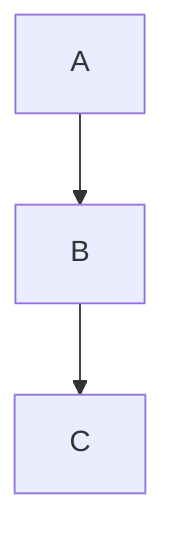

# NexAI

OpenAI-compatible AI chat client. Android/Web use Flutter + Material Design 3; Windows desktop uses native WinUI3. Notes, tools, encrypted cloud sync, and Android-oriented security hardening are included.


**Repository:** [github.com/Chloemlla/NexAI](https://github.com/Chloemlla/NexAI)

## Highlights

| Area | What you get |
| --- | --- |
| Chat | OpenAI-compatible + Google Vertex AI, streaming, multi-session, search, edit & resend |
| Rendering | GFM Markdown, syntax highlighting, LaTeX, chemistry (`\ce{...}`), Mermaid flowcharts |
| Notes | Markdown notes, tags, wiki-links, knowledge graph, save from chat |
| Tools | Media, converters, password generator, short URL, artifacts share, AI translate & image gen |
| Account | Login/register, Google Sign-In (Android/Web), Passkeys (Android) |
| Sync | NexAI `/sync/v2` end-to-end encrypted sync (+ WebDAV / Upstash options in settings) |
| Security | Secure storage, request signing, certificate pinning (TOFU), device checks (Android) |

## Features

### Chat

- **OpenAI-compatible API** — OpenAI, Claude proxies, DeepSeek, local models, and other `/v1` endpoints
- **Google Vertex AI** — Project / location / API key configuration in Settings
- **Streaming responses** — Token-by-token output with smart auto-scroll
- **Multiple conversations** — Unlimited sessions with per-session history
- **Message search** — Full-text search across conversations with highlighted hits
- **Edit & resend** — Edit a user message and regenerate from that point
- **Image generation** — Text-to-image / image-to-image via compatible APIs
- **Export bubble to PNG** — Capture any message bubble as an image

### Rendering

- **GitHub-flavored Markdown** with syntax-highlighted code blocks
- **LaTeX** — Inline `$...$` and display `$$...$$`
- **Chemistry** — `\ce{...}` notation
- **Mermaid flowcharts** — Parsed and painted from model output

### Notes

- **Markdown editor** with live preview
- **Tags** — `#tag` in body and YAML frontmatter
- **Wiki-links** — `[[note]]`, `[[note|alias]]`, `[[note#heading]]`
- **Knowledge graph** — Visual map of note connections
- **Star & organize** — Starred, recent, and tag-filtered views
- **Save from chat** — Persist an AI reply into a new or existing note

### Tools

| Category | Tools |
| --- | --- |
| Media | Video compressor, video → audio (MP3/AAC) |
| Convert | Date/time converter, Base64 encode/decode |
| Security | Configurable password generator with history |
| Network | Short URL, artifacts / content share |
| AI | AI translation, AI image generation |

### Appearance & UX

- **Material Design 3** on Android and Web
- **Fluent / WinUI3** on Windows desktop (`winui/`)
- **Dynamic color** — Follows system accent on Android 12+
- **Custom accent color**, font family, and reading size
- **Dark / Light / System** theme
- **Borderless mode** — Clean, bubble-free chat layout
- **Full-screen mode** — Immersive chat on Android

### Account, Sync & Settings

- **Account** — Email/username login & register
- **Google Sign-In** — Android and Web (when backend enables it)
- **Passkeys** — Android Credential Manager / WebAuthn-aligned flow
- **Cloud sync** — NexAI `/sync/v2` encrypted containers for settings, chats, notes, translation history, and short-URL history
- **Sync recovery key** — Export / import local sync key from Settings → Sync
- **WebDAV / Upstash** — Alternate sync backends available in Settings
- **Auto-update checker** — GitHub Releases on startup
- **Persistent settings** — Non-sensitive prefs in `SharedPreferences`; API keys, tokens, sync keys, and saved passwords in secure storage

### Security & Integrity (especially Android)

- **APK integrity checks** against release metadata when available
- **Certificate pinning** — TOFU with expiry / cache management
- **Device fingerprinting** — Multi-signal permanent device identity
- **Threat detection** — Root, VPN, debugger, emulator, Frida, Xposed (native Android path)
- **Security event reporting** — Backend reporting with risk scoring
- **Request signing** — HMAC-SHA256 signed backend requests
- **Honeypot mode** — Server-controlled handling for compromised devices
- **Secure login screen** — Screenshot / recording protection on the auth page

> Security claims describe client capabilities and intended protections. Treat production hardening as an ongoing process; see `docs/` and recent audit notes before relying on any single control.

## Quick Start

### Build via GitHub Actions (recommended)

CI is the supported path for release artifacts:
- Android/Web: Flutter **3.44.5**
- Windows: native WinUI3 (`winui/`) via MSBuild

1. Fork the repository
2. Open **Actions → Build NexAI → Run workflow**
3. Choose target: `windows`, `android`, `web`, or `all`
4. Download the workflow artifact when the job finishes

For signed Android release builds, configure repository secrets:

| Secret | Purpose |
| --- | --- |
| `KEYSTORE_BASE64` | Base64-encoded `.jks` keystore |
| `KEY_ALIAS` | Key alias |
| `KEY_PASSWORD` | Key password |
| `KEYSTORE_PASSWORD` | Keystore password |

Tag pushes matching `v*` run the **Release NexAI** workflow (analyze, test, build, publish).

### Local Development

```bash
flutter pub get
flutter run -d android
flutter run -d chrome
```

**Requirements:** Flutter `>=3.44.0`, Dart SDK `>=3.11.0 <4.0.0`

```bash
flutter analyze
flutter test
dart format lib test
```

Windows desktop development uses the native solution under `winui/` (built by CI). Do not recreate the legacy Flutter `windows/` host as the product path.

> Agents and contributors following this repo’s AGENTS instructions should rely on GitHub Actions for authoritative build/test validation rather than heavy local builds.

## Configuration

Open **Settings** in the app:

| Setting | Description | Default / notes |
| --- | --- | --- |
| Provider | OpenAI-compatible or Google Vertex AI | OpenAI-compatible |
| Base URL | API endpoint | `https://api.openai.com/v1` |
| API Key | Provider key | Stored in secure storage |
| Vertex Project / Location | Vertex AI routing | When provider = Vertex |
| Models | Comma-separated model list | User-defined |
| Temperature | Creativity (0–2) | `0.7` |
| Max Tokens | Response length limit | `4096` |
| System Prompt | Default assistant instruction | LaTeX-aware default |
| Font / Size | Chat typography | System / 14px |
| Borderless Mode | Remove chat bubbles | Off |
| Smart Auto-scroll | Follow streaming output | On |
| Cloud Sync | NexAI encrypted sync v2 | Off |
| Sync Recovery Key | Export / import local key | Settings → Sync |
| Certificate Cache | Clear pinning cache | Settings → Security |

## Rendering Examples

````markdown
Inline math:   $E = mc^2$
Display math:  $$\int_0^\infty e^{-x^2} dx = \frac{\sqrt{\pi}}{2}$$
Chemistry:     $\ce{H2O}$   $\ce{2H2 + O2 -> 2H2O}$
Flowchart:


````

## Project Structure

```
lib/
├── main.dart                 # Entry, platform setup, providers
├── app.dart                  # MaterialApp + dynamic theming
├── models/                   # Message, note, artifact, password, crash report, …
├── providers/                # Chat, settings, notes, auth, sync, tools state
├── pages/                    # Chat, notes, tools, settings, login, about, …
├── widgets/                  # Bubbles, markdown, mermaid, dialogs
│   ├── flowchart/            # Mermaid parser + custom painter
│   └── markdown/             # Markdown render helpers
├── services/                 # Backend client, auth, sync, security, crash, artifacts
│   └── android_native/       # Method-channel facades (fingerprint, passkey, media, …)
└── utils/                    # Security, crypto, update check, signing, helpers

android/                      # Android app + Kotlin native capability layer
windows/                      # Windows desktop runner
web/                          # Web entry
assets/                       # Icons, markdown CSS, fonts
docs/                         # Security, integration, and feature specs
test/                         # Unit & widget tests
.github/workflows/            # build.yml, release.yml, generate-icons.yml
scripts/                      # Build metadata, font subsetting, icons helpers
```

## Documentation

| Document | Topic |
| --- | --- |
| [`docs/SERVER_API_SECURITY.md`](docs/SERVER_API_SECURITY.md) | Backend security API |
| [`docs/NEXAI_CLIENT_INTEGRATION.md`](docs/NEXAI_CLIENT_INTEGRATION.md) | Client integration |
| [`docs/BACKEND_INTEGRATION_CONTRACT.md`](docs/BACKEND_INTEGRATION_CONTRACT.md) | Backend contract |
| [`docs/CERTIFICATE_ERROR_FIX.md`](docs/CERTIFICATE_ERROR_FIX.md) | Certificate verification troubleshooting |
| [`docs/security_hardening_checklist.md`](docs/security_hardening_checklist.md) | Hardening checklist |
| [`docs/flutter-artifacts-integration.md`](docs/flutter-artifacts-integration.md) | Artifacts share client |
| [`docs/artifacts-share-backend-spec.md`](docs/artifacts-share-backend-spec.md) | Artifacts share backend |
| [`docs/katex-chemical-rendering-spec.md`](docs/katex-chemical-rendering-spec.md) | Chemistry rendering |
| [`docs/GPTMARKDOWN_CSS_INTEGRATION.md`](docs/GPTMARKDOWN_CSS_INTEGRATION.md) | Markdown CSS integration |
| [`docs/android-kotlin-native-capability-migration.md`](docs/android-kotlin-native-capability-migration.md) | Android native migration |

## Security Notes

- Never commit API keys, keystores, signing passwords, or local certificate material.
- Android release signing is expected via GitHub Actions secrets, not hardcoded credentials.
- Review `docs/SERVER_API_SECURITY.md` and related contracts before changing request signing, pinning, sync, or device security code.

## 更新日志

按月份整理 2026 年提交。1–6 月完整列出全部 commit；7 月按主题分组。


### 2026 年 2 月

#### 02-24

**平台 / CI**

- `c9e4f77` 新增：initial NexAI Flutter app with CI/CD workflows
- `a8709c3` 修复：修正 secrets check syntax in GitHub Actions 工作流
- `81b670f` 修复：修正 secrets context usage in 工作流 condition
- `010713c` 修复：修复 GitHub Actions 工作流 中 secrets 上下文使用错误

**修复**

- `f21f7db` 修复：移除 invalid secrets condition, use continue-on-error instead
- `040b1cb` fix: 添加签名配置步骤的错误处理
- `ff72f8e` 修复：解决 Flutter 3.24 compilation errors
- `e78e931` 修复：解决 Flutter 3.24 compilation errors
- `cea97a7` 修复：解决 Flutter 3.24 compilation errors
- `48087b7` 修复：解决 Flutter 3.24 compilation errors
- `ce62df0` 修复：解决 Flutter 3.24 compilation errors
- `4f3103b` 修复：解决 Flutter 3.24 compilation errors
- `8d4171b` 修复：解决 Flutter 3.24 compilation errors
- `f9e8f17` 修复：解决 Flutter 3.24 compilation errors
- `04085d8` 修复：解决 Flutter 3.24 compilation errors
- `dad65f2` 修复：解决 Flutter 3.24 compilation errors
- `6ae42f0` 修复：解决 Flutter 3.24 compilation errors
- `8353b5f` 修复：解决 Flutter 3.24 compilation errors
- `cc37d03` 修复：解决 Flutter 3.24 compilation errors
- `b19ca52` 修复：解决 Flutter 3.24 compilation errors
- `2c6bb01` 修复：解决 Flutter 3.24 compilation errors
- `4157ac8` 修复：解决 Flutter 3.24 compilation errors

**杂项**

- `13ed318` 杂项：移除签名配置的条件判断

**CI / 构建产物**

- `3574ea4` CI：生成 Android 构建文件
- `24fee36` CI：生成 Android 构建文件
- `85c49ab` CI：生成 Android 构建文件
- `7f06a94` CI：生成 Android 构建文件
- `a237d44` CI：生成 Android 构建文件
- `6164371` CI：生成 Android 构建文件
- `7cd1caa` CI：生成 Android 构建文件
- `69ea891` CI：生成 Android 构建文件
- `c7b84ee` CI：生成 Android 构建文件
- `d2ea814` CI：生成 Android 构建文件
- `b48ac4c` CI：生成 Android 构建文件
- `4164d4c` CI：生成 Android 构建文件

**其他**

- `fcba5ac` 初始化仓库

#### 02-25

**功能**

- `4b27d31` 新增：增强 UX with improved animations, quick settings, and conversation management

**聊天 / 渲染**

- `ff19322` 修复(ci)：修正 web build flag from --wasm canvaskit to --web-renderer canvaskit
- `4bf4caf` 修复(ci)：修正 web build flag from --wasm canvaskit to --web-renderer canvaskit
- `28b24fd` 修复(ci)：修正 web build flag from --wasm canvaskit to --web-renderer canvaskit

**笔记 / 图谱**

- `5a01a14` 修复：移除 duplicate _save() block in NotesProvider that broke class scope
- `9971bf0` 修复：移除 duplicate _save() block in NotesProvider that broke class scope
- `0b7d48f` 修复：移除 duplicate _save() block in NotesProvider that broke class scope
- `fa97cf4` 新增：增强 notes UI with Material Design 3 styling and new features

**工具**

- `c0a6a48` 修复：移除 .dart_tool from CI cache to prevent stale plugin registrant

**安全 / 鉴权**

- `c8ccf96` 修复：解决 Android 16 crash with AppCompat themes, R8 proguard rules, and edge-to-edge compat

**Android / 发布**

- `971c65e` 构建(android)：upgrade to AGP 9.0.1 with compileSdk 36 support
- `cee04c8` 构建(android)：upgrade to AGP 9.0.1 with compileSdk 36 support
- `8c3b584` 构建(android)：upgrade to AGP 9.0.1 with compileSdk 36 support
- `95881d9` 修复：解决 Kotlin plugin conflict in Android build
- `2d47494` 修复：解决 Kotlin plugin duplicate registration in Gradle build
- `8645f68` 修复：解决 Kotlin plugin duplicate registration in Gradle build
- `8c96a27` 修复：移除 Kotlin plugin classpath for AGP 9.0+ built-in Kotlin support
- `f98cfd8` 修复：polyfill jcenter() as mavenCentral() for Gradle 9 compatibility
- `3cf0efb` 修复：移除 system_theme 依赖 to 修复 Gradle 9 jcenter() build failure
- `d76afde` 新增：auto-increment versionCode for APK overlay upgrade support

**平台 / CI**

- `ff3fd64` 修复(ci)：新增 apt-get 更新 before installing imagemagick to avoid stale mirror 404s
- `85d0eb6` 修复(ci)：新增 apt-get 更新 before installing imagemagick to avoid stale mirror 404s
- `5a96f88` 杂项：更新 工作流 to include auto-push with force option

**修复**

- `f79fb56` 修复：解决 Flutter 3.24 compilation errors
- `764a494` 修复：移除 evaluationDependsOn causing afterEvaluate conflict
- `3563450` 修复：禁用 built-in Kotlin globally to avoid conflicts with legacy plugins
- `9c492fd` 修复：移除 kotlin block when built-in Kotlin is disabled

**杂项**

- `792df6b` 杂项：移除 Generate app icons step from build.yml

**CI / 构建产物**

- `69697f1` CI：生成 Android 构建文件
- `94664fb` CI：生成 Android 构建文件
- `344f292` CI：生成 Android 构建文件
- `80c79cc` CI：生成 Android 构建文件
- `f269072` CI：生成 Android 构建文件
- `4a12ac5` CI：生成 Android 构建文件
- `e6a7eec` CI：生成 Android 构建文件
- `fb43ef2` CI：生成 Android 构建文件
- `c99ff4e` CI：生成 Android 构建文件
- `1cabefa` CI：生成 Android 构建文件
- `00877a0` CI：生成 Android 构建文件
- `a8f6128` CI：生成 Android 构建文件
- `0a1d0a8` CI：生成 Android 构建文件
- `80d6e77` CI：生成 Android 构建文件
- `1c4555c` CI：生成 Android 构建文件
- `fc9fb96` CI：生成 Android 构建文件
- `cad9d55` CI：生成 Android 构建文件
- `3ddf367` CI：生成 Android 构建文件
- `ccb2791` CI：生成 Android 构建文件
- `15ec32b` CI：生成 Android 构建文件
- `9626e9a` CI：生成 Android 构建文件
- `bcdc66d` CI：生成 Android 构建文件
- `6eea2dc` CI：生成 Android 构建文件
- `5aac4ac` CI：生成 Android 构建文件
- `950f7f5` CI：生成 Android 构建文件
- `cd6c09a` CI：生成 Android 构建文件
- `13c1a2b` CI：生成 Android 构建文件
- `ac915f0` CI：生成 Android 构建文件
- `b8cd449` CI：生成 Android 构建文件
- `2507bbb` CI：生成 Android 构建文件
- `c9fd9c2` CI：生成 Android 构建文件
- `c16dd6c` CI：生成 Android 构建文件
- `3619f42` CI：生成 Android 构建文件
- `b932197` CI：生成 Android 构建文件
- `5830dbd` CI：生成 Android 构建文件
- `fcfd4a4` CI：生成 Android 构建文件
- `8857b81` CI：生成 Android 构建文件
- `3bcfb72` CI：生成 Android 构建文件
- `f569f26` CI：生成 Android 构建文件
- `8ca034a` CI：生成 Android 构建文件
- `201fc23` CI：生成 Android 构建文件
- `6010c66` CI：生成 Android 构建文件
- `4640d83` CI：生成 Android 构建文件

**合并**

- `a7f225e` 合并 main 分支
- `7238f46` 合并 main 分支
- `457c7e1` 合并 main 分支
- `4d1f1bd` 合并 main 分支
- `a4f8e12` 合并 main 分支
- `909daf3` 合并 main 分支
- `ed6c97a` 合并 main 分支
- `cc416f3` 合并 main 分支
- `41b8693` 合并 main 分支
- `cb8afd2` 合并 main 分支
- `baf939a` 合并 main 分支
- `91a32bc` 合并 main 分支
- `8d406e2` 合并 main 分支
- `7a5ba03` 合并 main 分支
- `21b3ae1` 合并 main 分支
- `4a31f94` 合并 main 分支
- `ef21b6e` 合并 main 分支
- `75107ee` 合并 main 分支
- `7deea7e` 合并 main 分支
- `727dc52` 合并 main 分支
- `f839aef` 合并 main 分支

#### 02-26

**功能**

- `ff47574` 新增：新增 auto-更新 detection mechanism with GitHub Releases integration
- `05d4db6` 新增：新增 confirmation prompt before pushing secrets to GitHub
- `e4cf97b` 新增：新增 edit and resend functionality for user messages
- `309a0e0` 新增：新增 Doubao model type explanation cards with usage examples for normal and group modes

**聊天 / 渲染**

- `729ef5d` 修复：修正 navigation to 设置页 from chat error banner
- `3058ac1` 杂项：localize chat_page.dart text to Chinese
- `0980ce6` 性能：optimize large article rendering performance
- `916666f` 重构：替换 flutter_markdown_plus with gpt_markdown
- `e6f37f3` 重构：替换 flutter_markdown_plus with gpt_markdown
- `d97cf2c` 修复：修正 gpt_markdown API usage and 移除 unsupported parameters
- `6d7fe89` 修复：移除 unsupported parameters from GptMarkdown widget
- `bff0f62` 重构：迁移 HTTP client from http package to dio for chat API requests
- `bb526c9` 重构：迁移 HTTP client from http package to dio for chat API requests
- `3024038` 新增：新增 image generation feature with three API modes (chat, generation, edit)
- `9b1e761` 重构：集成 image generation into 聊天页 instead of separate navigation tab
- `6d9d25c` 修复：修正 dio stream transform and error handling in chat provider
- `b203ca9` 修复：修正 stream transform usage in chat provider for dio ResponseBody

**笔记 / 图谱**

- `1412ab3` 新增：新增 auto-save toggle for notes with manual save button
- `2ac6418` 新增：新增 auto-save toggle for notes with manual save button
- `b325f5b` 杂项：localize graph_page, home_page, about_page, and notes_page to Chinese
- `66781e2` 杂项：localize note_detail_page to Chinese
- `6bc7fef` 新增：新增 multiple entry points to knowledge graph page
- `f851504` 重构：simplify graph page access to only top bar button in 笔记页
- `0b8fb48` 重构：移除 knowledge graph floating action button from 笔记页
- `7b3d52a` 重构：simplify create note FAB to icon only
- `f7541ab` 修复：解决 text label clipping in graph page nodes

**工具**

- `c434543` 修复：改进 base64 encoding in signing setup script to avoid line breaks
- `7ed62c9` 新增：新增 视频压缩 with advanced settings
- `ee78cc0` 修复：解决 potential error hazards in 视频压缩 page
- `f483d9f` 重构：beautify 工具页 with grid layout and modern design
- `5446859` 修复：更新 视频压缩 for v_video_compressor API changes
- `bc25640` 新增：新增 video playback support for compressed videos using media_kit
- `db7b8de` 修复：use outputPath instead of path for VVideoCompressionResult
- `90baa14` 修复：替换 broken media_kit_video git fork with official pub.dev package v2.0.1
- `b92b3d8` 修复：use compressedFilePath instead of outputPath for v_video_compressor v2.0.0 API and 清理 stale pub git cache in CI
- `e4abe6c` 修复：downgrade media_kit_video to ^1.3.1 to avoid meta version conflict with Flutter 3.41.0
- `2f1e4c9` 修复：downgrade media_kit_video to ^1.3.1 to avoid meta version conflict with Flutter 3.41.0
- `7fc6556` 修复：downgrade media_kit_video to ^1.3.1 to avoid meta version conflict with Flutter 3.41.0
- `c8a1c2a` 重构：optimize tool card layout with improved spacing and visual hierarchy
- `df98b63` 新增：新增 Doubao image generation model support with special parameters (type, n, watermark, size)
- `2eebb98` 新增：新增 date time converter tool with multiple format support (ISO 8601, RFC, Unix, Mongo, Excel)
- `35685ad` 新增：新增 date time converter tool with multiple format support (ISO 8601, RFC, Unix, Mongo, Excel)
- `dcb46e6` 新增：新增 Base64 encoder/decoder tool with URL safe mode support
- `e74868d` 新增：新增 密码生成器 tool with random, memorable, and PIN modes
- `c41e5ac` 新增：新增 password management system with SavedPassword model and PasswordProvider
- `52146c8` 新增：complete 密码生成器 with batch generation, save management, export/import, and backup features
- `a74d943` 新增：save compressed video to gallery with permission handling
- `22845d1` 重构：optimize date time converter layout for mobile with vertical cards and copy buttons
- `c2d1107` 新增：redesign date time converter with hero header, quick actions, and polished result tiles
- `e28c7c3` 新增：新增 categorized section headers with icons and polish 工具页 layout
- `83576a6` 新增：新增 batch video-to-audio extraction tool using ffmpeg_kit_flutter_new

**安全 / 鉴权**

- `31c9af8` 修复：新增 ffmpeg_kit proguard keep rules and MANAGE_EXTERNAL_STORAGE permission to 修复 black screen on startup

**Android / 发布**

- `d54b3db` 修复：downgrade AGP 9.0.1 to stable 8.7.3 with Gradle 8.9, JDK 21, compileSdk/targetSdk 35
- `93492b2` 修复：force androidx transitive deps to compileSdk 35-compatible versions
- `da06b90` 新增：unify version control via build.ps1 and rename APK outputs with version info
- `2f61520` 修复：修正 APK naming in build.yml automatic 发布 and 新增 AAB upload
- `53e0194` 修复：新增 debug logging to APK rename process in build.yml
- `0da9397` 修复：移除 archivesBaseName to 启用 split-per-abi APK generation
- `f28e919` 修复：改进 signing config error handling and fallback to debug signing gracefully
- `1fd3167` 修复：移除 sensitive keystore files and 修复 signing config
- `689e312` 修复：inject full version with hash into BuildConfig for Android builds
- `2dd7020` 修复：解决 manifest merger conflict for WRITE_EXTERNAL_STORAGE maxSdkVersion

**平台 / CI**

- `e565ff9` 杂项：更新 依赖 to latest compatible versions
- `4c03320` 杂项：新增 explicit version constraints for transitive 依赖

**修复**

- `15b05e1` 修复：新增 debug suffix to distinguish debug-signed builds and prevent upgrade conflicts
- `a7f24d6` 修复：改进 GitHub repo detection with fallback to git remote parsing
- `4953ca4` 修复：use 修正 property name selectedModel instead of model
- `ead3a42` 修复：新增 Scaffold wrapper to prevent black background in 关于页
- `e9feaf5` 修复：解决 build errors - Utf8Decoder, Java version, and Kotlin compatibility
- `85db50d` 修复：use LineSplitter for proper stream transformation
- `66f12be` 修复：cast stream to List<int> for dart2js utf8.decoder compatibility
- `e944ca7` 修复：switch to ffmpeg_kit_flutter_new_audio for mp3/audio codec support
- `a506603` 修复：revert to ffmpeg_kit_flutter_new (full-gpl) which includes all audio codecs, 修复 import path

**CI / 构建产物**

- `25694fa` CI：更新 build.yml to generate multi-arch APKs with NexAI_android_{version}_{abi}.apk naming
- `c1a9825` CI：禁用 AAB build and 发布, only build and publish APK files
- `92c82c2` CI：生成 Android 构建文件
- `9800357` CI：禁用 AAB build and 发布, only build and publish APK files
- `d15b180` CI：生成 Android 构建文件
- `22faf0f` CI：生成 Android 构建文件
- `1e00fd3` CI：生成 Android 构建文件
- `b7115b2` CI：生成 Android 构建文件
- `116d6b6` CI：生成 Android 构建文件
- `fdb6ada` CI：生成 Android 构建文件
- `2fc7c8b` CI：生成 Android 构建文件
- `5977641` CI：生成 Android 构建文件
- `0dbf3e7` CI：生成 Android 构建文件
- `3d83a04` CI：生成 Android 构建文件
- `782de1c` CI：生成 Android 构建文件
- `d119936` CI：生成 Android 构建文件
- `0b6dfb4` CI：生成 Android 构建文件
- `9163874` CI：生成 Android 构建文件

**合并**

- `918c0e2` 合并 main 分支
- `6c23334` 合并 main 分支

**其他**

- `51adbcf` 重构：rename pili to nexai in version metadata
- `bc072a3` 重构：move 关于页 entry from bottom nav to 设置页
- `b2b6586` 国际化：localize 设置页 text to Chinese

#### 02-28

**聊天 / 渲染**

- `a2f4d57` 新增：增强 chat UI with borderless mode, full-screen, custom fonts, smart scroll, Markdown preview, search, and export features
- `4d71f15` 新增：增强 chat UI with borderless mode, full-screen, custom fonts, smart scroll, Markdown preview, search, and export features
- `4657990` 新增：实现 export chat bubble to PNG functionality using RepaintBoundary

**工具**

- `fbc55ff` 样式：Beautify 密码生成器 page UI
- `a0b4169` 样式：Beautify 密码生成器 page UI
- `1cb1ba5` 新增：更新 short url api to api.mmp.cc

**Android / 发布**

- `fb15d02` 修复：修正 version and apk file name to 1.1.6-shortsha
- `4ca1b1d` 修复：解决 storage permission issues and 实现 export functionality on Android

**平台 / CI**

- `b6ebc9b` 修复：prevent infinite ci loops in build 工作流
- `dbcc124` 修复：set pubspec version to 1.1.6-shortsha and use build-number in CI

**CI / 构建产物**

- `b6fcfef` CI：生成 Android 构建文件
- `a6319ba` CI：生成 Android 构建文件
- `facbcfd` CI：生成 Android 构建文件
- `98282bf` CI：禁用 Android appbundle build
- `1693855` CI：生成 Android 构建文件 [skip ci]
- `332fe1c` CI：生成 Android 构建文件 [skip ci]

**合并**

- `5e6f2cb` 合并 main 分支

### 2026 年 3 月

#### 03-01

**功能**

- `2da8321` 新增：新增 .claude/ and CLAUDE.md to .gitignore
- `66d591d` 新增：新增 AI title generation toggle in settings
- `b87551e` 新增：集成 package_info_plus for version management in settings and 更新 checker
- `b135ec0` 新增：新增 OpenAI Compatible and Vertex AI API Modes
- `283f8a6` 新增：实现 API mode selection and 集成 Google Vertex AI, including new settings UI and backend routing.

**聊天 / 渲染**

- `86a927b` 修复：解决 build errors in message_bubble and related files
- `00ac6bc` 修复：restore missing ChatProvider class declaration and 修复 regex escaping
- `9d71a7d` 新增：Initialize NexAI application with core structure, theming, multiple utility pages, and Mermaid flowchart parsing.
- `c9aa16a` 新增：实现 core application structure, AI chat, various utility tools, and persistent settings.
- `540e6ef` 新增：detail API request information on chat errors
- `aa30d95` 新增：select text and copy in 聊天页
- `4af88a1` 新增：新增 core application pages and UI components including welcome, chat, image generation, and settings.
- `83c1d00` 重构：移除 fluent_ui, unify to Material Design, 修复 Markdown rendering pipeline

**工具**

- `dc4a20c` 新增：新增 Vertex AI translation and 修复 version consistency
- `5afaf73` 新增：新增 Vertex AI translation and 修复 version consistency
- `4a16844` 重构：switch to Gemini 2.0 Flash API for translation

**安全 / 鉴权**

- `d1727ae` 修复：解决 four critical data integrity and security issues

**Android / 发布**

- `7818951` 杂项：comment out commit step in CI 工作流 and 移除 sensitive information from gradle.properties

**平台 / CI**

- `269ecf6` 杂项：trigger CI
- `0e5f8ef` 修复：修正 indentation for automatic 发布 step in CI 工作流
- `23c7286` 杂项：启用 web build in CI 工作流 and 更新 related steps
- `0edbfb0` 新增：启用 windows build
- `1026fa6` 新增：启用 windows build in 发布 工作流
- `07ad06a` 修复：restore windows build directory in CI
- `4144660` 修复：pass assets path to DartProject constructor for Windows build

**修复**

- `68b8894` 修复：解决 four medium-severity code quality issues
- `08a4936` 修复：解决 five minor code quality issues
- `d064d51` 修复：修正 GitHub repository name casing in 更新 checker
- `02eb840` 修复：comprehensive version 发布 system fixes
- `5701a9c` 修复：改进 AI title generation and version 更新 logic

**文档**

- `56d0e30` 文档：重写 README to reflect current project state
- `de80699` 文档：create comprehensive CLAUDE.md and 移除 from .gitignore
- `f3e3c92` 文档：改进 formatting and clarity in CLAUDE.md

**杂项**

- `48d0810` 杂项：更新 version to 1.0.7 and adjust related configurations

**CI / 构建产物**

- `9a1a513` CI：生成 Android 构建文件 [skip ci]
- `1ad9b62` CI：生成 Android 构建文件 [skip ci]
- `e5df02e` CI：生成 Android 构建文件 [skip ci]

**合并**

- `9ca2682` 合并 main 分支

#### 03-02

**功能**

- `e99fba7` 新增：新增 an 关于页 displaying application information, features, and tech stack.

**聊天 / 渲染**

- `627ea4c` 修复：修正 RegExp caseSensitive parameter in mermaid pattern

**笔记 / 图谱**

- `f8370ce` 新增：新增 RichContentView widget to render rich text with Markdown, LaTeX, chemical formulas, Mermaid diagrams, and wiki-links.
- `f764690` 新增：allow note title to wrap across multiple lines in NoteCard
- `fe385f5` 样式：新增 line-height 1.4 to note card title for better readability

**安全 / 鉴权**

- `fd01b6c` 新增：新增 NexAI auth integration with Google OAuth and login/register UI
- `5a9892b` 新增：新增 登录页 entry in settings with account card and Google OAuth quick login

**Android / 发布**

- `0338499` 修复：解决 signing config not detected due to CRLF line endings in gradle.properties

#### 03-03

- `f519ff1` 修复：always show Google 登录 button in 登录页 regardless of backend config

#### 03-08

**功能**

- `4cf2ace` 新增：新增 initial launch screen styling and background resources with dark mode support.
- `ec879f3` 新增：新增 a new Material Design 3 styled login and registration page with tabbed forms and Google 登录.
- `bc7184f` 新增：新增 new AboutPage for displaying application information, features, and links.
- `980000c` 新增：新增 关于页 displaying app information, features, and tech stack

**聊天 / 渲染**

- `16ba60e` 新增：新增 core application pages and common UI widgets including About, Chat, Home, Login, and Settings pages, along with message bubble and welcome view components.
- `65ac28a` 新增：实现 core application UI by adding home, chat, settings, login, and about pages along with essential widgets.

**工具**

- `a0d56d9` 新增：Configure and automate Android app launcher icon generation and 新增 DevTools options.

**安全 / 鉴权**

- `24cb572` 新增：实现 user authentication with login/register pages, an authentication provider, and a 设置页.
- `a24987a` 修复：解决 依赖 conflicts with passkeys package
- `3f06a50` 新增：新增 comprehensive 设置页 with API configuration and account management, and introduce NexAI authentication service.
- `ae6feef` 修复：更新 passkeys package API usage for v2.17.4
- `ecfaef1` 新增：新增 NexAI authentication service with methods for registration, login, social auth, profile management, password reset, and Passkey/WebAuthn.
- `f326f5e` 修复：新增 asset_statements for Passkey/WebAuthn support on Android

**同步**

- `b0bd147` 新增：Introduce short URL generation, translation, synchronization, and settings pages with their respective state management providers.
- `d4c34e1` 新增：实现 cloud synchronization for app data, including translation history, with new sync service and 设置页.
- `e129346` 修复：robust json parsing for SavedPassword and 修复 sync json format

**Android / 发布**

- `46ccff7` 构建：新增 auto-generated Flutter plugin registrations for Android.
- `30581a8` 新增：新增 GitHub Actions workflows for automated app icon generation and multi-platform 发布 builds, along with new Android color definitions.

**平台 / CI**

- `58c2c69` 新增：Configure flutter_launcher_icons for Windows app icon generation and 新增 the generated icon.

**其他**

- `d167083` 重构：替换 Google icon with custom GoogleLogoPainter in login and settings pages
- `5c9703d` 样式：移除 color padding around app icons

#### 03-13

**功能**

- `52d94bc` 新增：集成 NexAI security backend API

**聊天 / 渲染**

- `2ebcf55` 文档：新增 KaTeX chemical equation rendering technical specification
- `c6bd9af` 新增：集成 GitHub Markdown CSS theme
- `999c497` 文档：新增 GptMarkdown CSS integration technical guide
- `edaaa9f` 新增：集成 gpt_markdown_chloemlla with CSS theme support

**安全 / 鉴权**

- `e19d98d` 安全：迁移 sensitive secrets to FlutterSecureStorage, 启用 Dart obfuscation in CI
- `bd03d8f` 安全：TOFU cert pinning with expiry lifecycle management
- `091e87e` 安全：APK integrity TOFU, root honeypot, HMAC request signing, FLAG_SECURE on login
- `a1d0b54` 安全：新增 APK file hash verification against GitHub releases
- `bc67281` 安全：新增 anti-debug, emulator detection, VPN detection and risk scoring
- `b9aa266` 安全：增强 VPN detection with 5-layer approach
- `7748984` 安全：新增 device fingerprinting, DEX integrity, API security headers
- `523bfe2` 修复：移除 unused warnings (backup cert keys and put method)
- `55a9b30` 文档：新增 certificate error 修复 guide and development mode option
- `244551d` 新增：新增 certificate cache clearing in settings

**同步**

- `1966021` 新增：新增 NexAI Cloud Sync API service for data synchronization endpoints.

**修复**

- `adffac9` 修复：_chargePattern lookbehind prevents reaction + from being superscripted as ion charge
- `4ac1357` 修复：precompile bare-caret regex, setState in didUpdateWidget, braces in if, trim fallback segment
- `61cd190` 修复：新增 null safety checks for Kotlin compilation

**文档**

- `fc0ae7c` 文档：新增 security hardening checklist
- `6aad684` 文档：更新 README with security features

#### 03-14

**功能**

- `b6dac55` 新增：集成 vivo Sans as default app font
- `556b73d` 新增：新增 HarmonyOS Sans and vivo Sans font families to assets and 移除 icon.png.
- `361f173` 新增：新增 HarmonyOS Sans and vivo Sans font families to assets and 移除 icon.png.
- `c930415` 新增：dynamic font selection from availableFonts constant
- `fe46e1c` 新增：新增 OPPO Sans 4.0 variable font support
- `96d1295` 新增：新增 startup loading dialog with typewriter effect
- `be1ab2f` 新增：替换 text-only messages with FontAwesome icons
- `40d99ed` 新增：新增 back button to 登录页
- `7043cb1` 新增：启用 back button in 关于页
- `cbdb7e0` 新增：集成 SettingsProvider theme config in startup dialog
- `4adc2d4` 新增：separate OpenAI and Vertex AI configurations

**聊天 / 渲染**

- `8cdac10` 新增：introduce artifact management page and a comprehensive message bubble with rich content display and sharing capabilities.

**笔记 / 图谱**

- `4e5715a` 新增：新增 Notes and Tools navigation to desktop layout

**工具**

- `db5144b` 新增：集成 NexAI Artifacts sharing feature
- `c579716` 新增：新增 NexAI artifacts API service for managing artifacts with CRUD operations and view tracking.

**安全 / 鉴权**

- `af49309` 修复：auto-recover from certificate rotation after app updates
- `40a1801` 修复：await auth initialization to restore login state
- `0c6da75` 修复：移除 certificate pinning from artifacts service
- `22ca580` 修复：新增 ProGuard rules to prevent Passkey obfuscation
- `a4ccaa4` 修复：新增 ProGuard rules to prevent OpenAI API config obfuscation
- `5bef2ee` 修复：handle null credentials list in Passkey registration/authentication
- `f81cb38` 修复：comprehensive null safety for Passkey registration/authentication
- `db8176e` 新增：新增 comprehensive Passkey debug dialog with full context

**修复**

- `5fd0fbe` 修复：make font selector actually switch fonts
- `8c54885` 修复：handle missing SettingsProvider in startup dialog
- `2a112a1` 修复：移除 duplicate _apiMode declaration
- `0727410` 修复：correctly handle dollar-wrapped \ce{} chemical equation format
- `a9c3955` 修复：pinned_http_client probe crash + login lost on restart
- `c9db7a5` 修复：suppress AWT warnings from Apache Commons Imaging

**其他**

- `fd57a09` 重构：移除 all emoji usage from codebase
- `8732e3f` 重构：改进 dark/light mode adaptation for startup dialog

#### 03-16

**功能**

- `6439411` 新增：迁移 to SAF for fine-grained file access permissions

**安全 / 鉴权**

- `14bfd27` 新增：新增 comprehensive error tracking for Passkey and Google 登录
- `be8644b` 修复：prevent Passkey module obfuscation in 发布 builds
- `c33e797` 修复：解决 compilation errors in authentication and file operations
- `f441e50` 修复：comprehensive error handling for sync/auth/translation services
- `a17953c` 修复：移除 extra closing brace in passkey_debug_dialog.dart
- `9bf0a58` 修复：增强 Passkey registration/authentication option sanitization
- `eec3dd6` 修复：修正 _decodeBody method reference in AuthResponse.fromResponse
- `ea333d9` 修复：改进 Google OAuth error handling and validation
- `99e0045` 修复：handle empty displayName and hints array in Passkey registration
- `0321d99` 修复：parse OAuth config with nested google/github objects
- `d531a4a` 修复：新增 empty transports array to credentials in Passkey options
- `8d6a2b0` 修复：移除 credProps extension from Passkey registration options

**同步**

- `2adc0e6` 修复：新增 await to all async save operations in providers

**修复**

- `60c8626` 修复：新增 platform check for Google 登录 (desktop not supported)

**杂项**

- `968384c` 杂项：移除 unused HarmonyOS Sans font variants
- `2abbc76` 杂项：移除 unused vivo Sans Global font

#### 03-24

- `0421697` 修复：mark _onMenuAction as async to 解决 await compile error

#### 03-27

- `d2f955e` 新增：introduce note detail page featuring Markdown editing, preview, stats, and outline generation.

### 2026 年 4 月

#### 04-04

- `7721c5e` 修复：overhaul Markdown rendering pipeline

#### 04-06

**聊天 / 渲染**

- `3fd411d` 改进 chat and desktop UX flow
- `dcda217` 新增：refine chat and tools interactions

**工具**

- `b304e12` 新增：unify tool subpage UI shell
- `bbe5c68` 修复：adapt tool hero layout to content

**Android / 发布**

- `35f9137` 修复：解决 Android page header overlap
- `2cf8b38` 修复：解决 Android page header overlap

**修复**

- `a4cbe92` 修复：移除 duplicate bottom tab titles
- `84cfb6a` 修复：harden 发布 更新 versioning
- `b2cd8bc` 修复：harden 发布 更新 versioning
- `283f62d` 修复：harden 发布 更新 versioning

**杂项**

- `d8345fe` 杂项：清理 analyzer issues
- `3183706` 杂项：清理 analyzer issues

**其他**

- `1595391` refactor startup bootstrap flow

### 2026 年 5 月

#### 05-29

- `83c4022` 修复：adapt tool hero layout to content

- `421354e` 修复：harden backend sync and diagnostics

### 2026 年 6 月

#### 06-05

- `61d358b` 新增：移除 CLAUDE.md and GEMINI.md documentation files
- `acd0077` 新增：新增 a custom FluxGlassDock widget for navigation bar with animated glow effects

- `73cc0b7` 修复：增强 Android signing secret handling and 更新 发布 notes

- `35d555b` 修复：更新 ffmpeg_kit_flutter_new 依赖 version to avoid broken Windows plugin

- `aea1dce` 文档：新增 comprehensive NexAI project guidelines document

- `cf77cef` 重构：移除 deprecated FluxGlassDock widget from 主页

#### 06-10

- `2550e9d` 更新 README to include setup instructions for new contributors

#### 06-30

- `e3994ec` 修复：新增 detailed OAuth config debug info and handle exceptions properly

- `0b0cfd6` 修复：更新 Gradle cache paths and cache keys for consistency

- `360f450` 改进 build environment by setting CL variable in Windows build workflows

- `6b75eb4` 更新 PowerShell UTF-8 reading instructions for garbled text issue
- `d86be12` 更新 AGENTS.md to emphasize do not write to super files and clarify commit message automation process

### 2026 年 7 月

#### 07-04

- `1fb6d8b` 调整 Android 构建，排除媒体库并清理插件注册
- `a880b35` Android 原生存储改用 MMKV
- `336dc7b` 新增完整代码审计报告
- `af69238` 加固同步发布与后端安全
- `de28495` 恢复媒体与对话框编译兼容
- `3bc2b81` 移除无用 media kit 启动逻辑
- `e53080a` 处理 analyzer 问题
- `c07af6f` 加固视频压缩元数据加载
- `14228f4` 强化 Android release 混淆
- `394360f` 强化 release shrinking

#### 07-07

- `eb5ed47` 对齐 Passkey Credential Manager 集成
- `7e4cae5` 接入 credential manager signal API
- `8b1da0c` 更新 `auth_provider.dart`

#### 07-12

- `c1429c6` Android 栈升级到 AGP 9.2.1 / compileSdk 37
- `a5132a7` NexAI Passkey 流程对齐 Happy-TTS WebAuthn 契约
- `fbc2e19` 支持无用户名的 discoverable Passkey 登录

#### 07-13

- `c9f0ddf` Passkey 用户取消按软取消处理

#### 07-15

- `a43ab16` 按当前功能与技术栈完善 README
- `a2da906` 防止 Google 头像网络失败导致崩溃
- `e802003` 加固密码备份、离线鉴权与完整性校验
- `3b37c24` 集成 Lumen Crash SDK 用于 Android 宿主崩溃

#### 07-16

**构建 / 崩溃**

- `364fd9b` 满足 auth 初始化 prefer_conditional_assignment
- `94009a4` CrashGate 报告状态改为可空类型
- `3a84d44` 修复 lumen-crash 空 POM 版本的 Compose 依赖声明
- `d548ff9` 防止 lumen-crash release 冷启动白屏
- `3f02e71` 桥接 Flutter 崩溃到 lumen-crash
- `2697c5a` 回退 Android 上的 Flutter lumen-crash bridge
- `85ded7b` 为 Android 构建离线预置 lumen-crash-core

**Passkey / 安全**

- `0d68857` Passkey 优先使用 Google Password Manager
- `b00429f` 新增 Google-only Passkey provider 开关
- `ebbf401` 增加 Passkey provider 诊断
- `0c36958` 启动时建立安全快照
- `8f3d15d` 稳定后台任务与通知
- `3367247` 强化更新包校验
- `99ebdd8` 扩展 anti-debug 与指纹信号
- `8dc6b13` 诊断 Android apk-key-hash base64 origin 不匹配

**Android 适配 / UI**

- `a12b2bc` 保持聊天布局在键盘上方
- `d7c1e05` 规划 Android Kotlin 边界加固
- `7971a74` 固化 Android Kotlin 边界加固计划
- `e8f02fa` 按 Vivo Android 13–17 指引适配 NexAI
- `8b41061` 补充 Android 11 Vivo 适配文档与更新说明
- `8052059` 修复 release Kotlin 构建，并处理 Android 11 包可见性
- `651bcf1` 以 Project Lumen 主题重绘 soft surfaces

#### 07-17

**Passkey / 鉴权 / 安全**

- `7a1a910` auth 诊断使用 null-aware map entry
- `47baa14` 修正 Passkey apk-key-hash 编码不匹配检测
- `5de8036` 对齐 NexAI 客户端安全/API 与后端契约
- `c4198d5` 实现 NexAI sig-v2 客户端签名与分阶段错误弹窗
- `dcfc8c8` 同步/分享失败分阶段弹窗，refresh 使用 refreshToken 签名

**首次安装开源声明**

- `a9e932f` 新增首次安装开源声明页
- `a27fbc6` 加固首次安装开源声明生命周期
- `ee73adc` 加固多平台开源声明安装检测
- `87229ba` 收口首次安装开源声明剩余边界问题
- `26a4980` 清理 lumen 与 oss notice 的 analyzer 警告

**Android Lumen UI 重写与收口**

- `8c30698` 全量 Project-Lumen soft-surface UI/UX 重写
- `6430e5c` 重写后恢复 Lumen soft-surface 契约
- `af775a9` 清理残留 marketing gradient
- `18a52c5` 继续硬化剩余 soft-surface 残留
- `8375135` 迁移漏掉的 soft-surface 页面壳
- `d932dad` 视频工具 raw Card helper 重写为 Lumen 表面
- `c998e59` 执行 Android Lumen UI 绝对 0 残留清理
- `d82cdd4` 完成 100% Lumen kit 收口

**崩溃上报 / UX 修复**

- `afbf354` 从 lumen-crash 适配 NexAI 崩溃上报
- `eefcdcd` 修复视频预览播放器 UX
- `7e97f8d` 修复跨页面交互 UX：图谱可点、笔记 FAB 遮挡、空剪贴板反馈、绘图失败提示
- `ec03166` 修复 login/sync 与 `const Theme.of` 相关 analyzer 错误

## License

[GPL-3.0](LICENSE)
